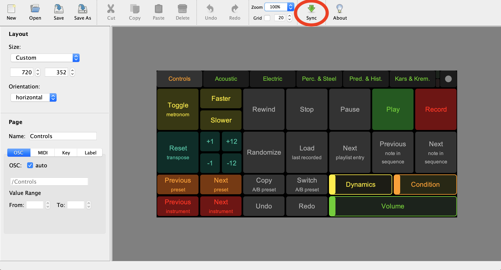
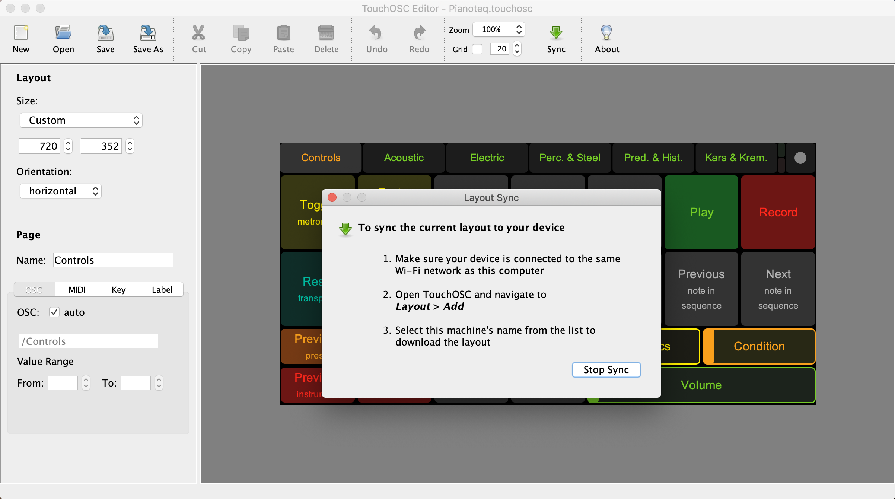
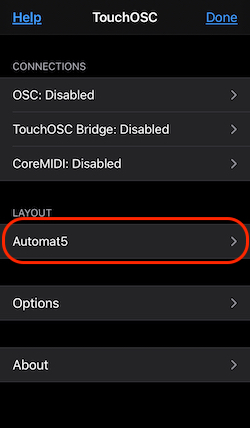
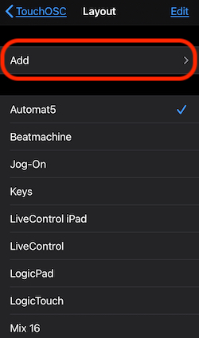
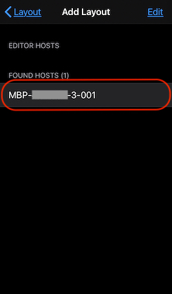
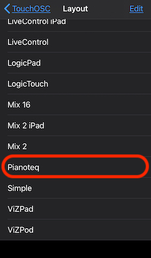
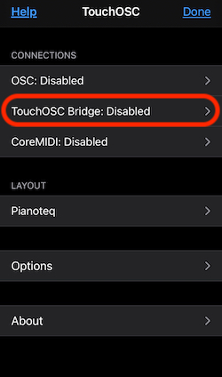
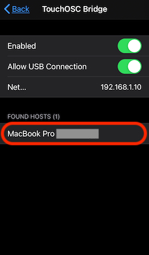
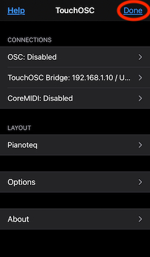

# TouchOSC for Pianoteq

control interface for [Pianoteq](https://www.modartt.com/pianoteq) using a [TouchOSC](https://hexler.net/products/touchosc) layout.

After a small setup, you will be able to control Pianoteq via your smartphone and/or your tablet.

## Screenshots

**Controls** page:  

**Acoustic** page:  

## Setup

### TouchOSC

1. Install `TouchOSC` app on your mobile device (Android, iOS):  
   https://hexler.net/products/touchosc#get

2. Sync Pianoteq layout to your mobile device:

   > **Note:** This step is only required as long as the Pianoteq layout is not shipped directly with the TouchOSC app.

   - Install `TouchOSC editor`:  
     https://hexler.net/products/touchosc#resources

   - Download the actual pianoteq TouchOSC layout:  
     [Pianoteq.touchosc](https://github.com/tobx/touch-osc-for-pianoteq/raw/main/Pianoteq.touchosc)

   - Open TouchOSC layout `Pianoteq.touchosc` with TouchOSC editor

   - sync it to your mobile device doing the following (other methods available [here](https://hexler.net/docs/touchosc-editor-sync)):
    1. Connect your mobile device **AND** your computer to the **SAME** Wifi network,
    2. Click on `Sync` in the `TouchOSC Editor`:

      

    3. The dialog box relative to syncing should appear:

      

    4. open the `TouchOSC` app on your mobile device (the following example shows iOS but it should be equivalent on Android). The following screen should appear. Click on the proposed `Layout`:

      

    5. Click on the `add` button:

      

    6. Click on your computer name that should appear. For many reasons, this can be cumbersome and the name of the computer may not appear. If unfortunately needed, try several times and/or reconnect to the wifi network:

      

    7. After a quick download/upload on your mobile device you should see `Pianoteq` in the list of available layouts. Click on it:

      

      Your modible device is ready and need now to communicate with your computer.

3. Download and launch [*TouchOSC Bridge*](https://hexler.net/products/touchosc) on your computer to "pair" your mobile device to your computer. (If you want to use directly OSC or CoreMIDI as transfert protocols, see the setup process [here](https://hexler.net/docs/touchosc-configuration-connections)).
   
  - On your mobile device, in the TouchOSC app click on `TouchOSC Bridge:xxxxx`:

      

  - `enable` TouchOSC Bridge if it is not already the case, and click on your computer name that should appear:

      

  - On the main page click `Done` and you should see the actual pianoteq control board:

      

  It should also appear as an active MIDI device on your computer!

### Pianoteq

1. Activate the TouchOSC midi input (as configured above):

      - Open the `Devices` page in the Pianoteq options.
      - Activate the TouchOSC MIDI input next to `Active MIDI inputs`.

2. Install MIDI mapping:

   - Download MIDI mapping:  
     [TouchOSC.ptm](https://github.com/tobx/touch-osc-for-pianoteq/raw/main/TouchOSC.ptm)

   - Copy MIDI mapping `TouchOSC.ptm` to the `MidiMappings` folder.
   > **Note:** In the future you may be able to drag the file directly onto the Pianoteq interface.

     To find the `MidiMappings` folder:
      
     - Open the `MIDI` page in the Pianoteq options.
     - Open the `Global MIDI Mapping` dropdown.
     - Click on `Browse...` (see screenshot below).

   - Load the Pianoteq MIDI mapping `TouchOSC` (see screenshot below).

     
